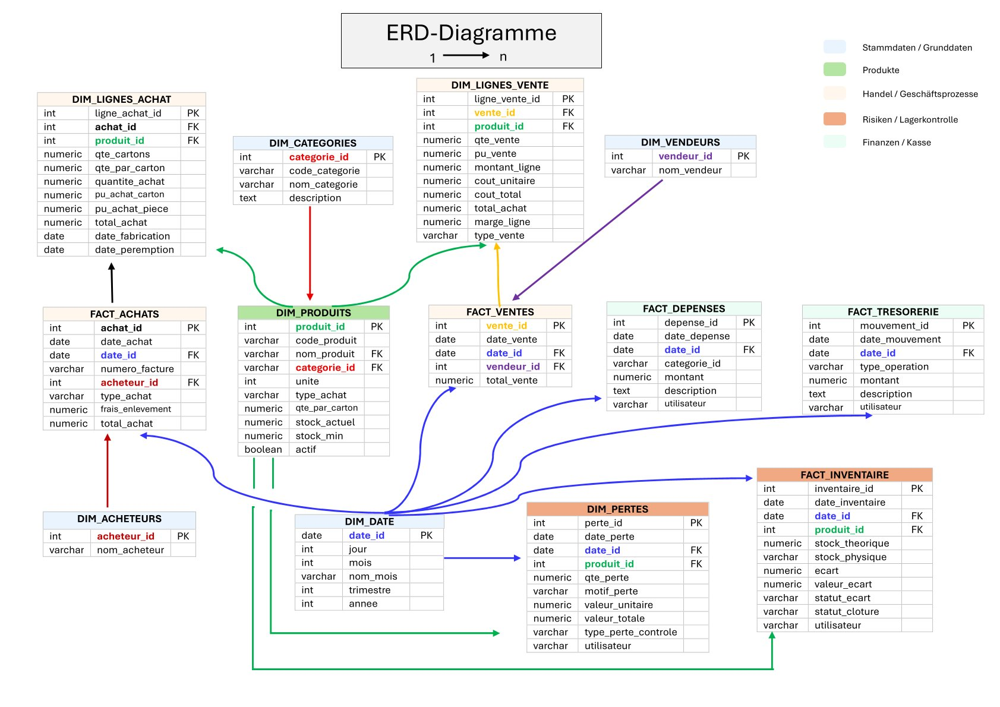
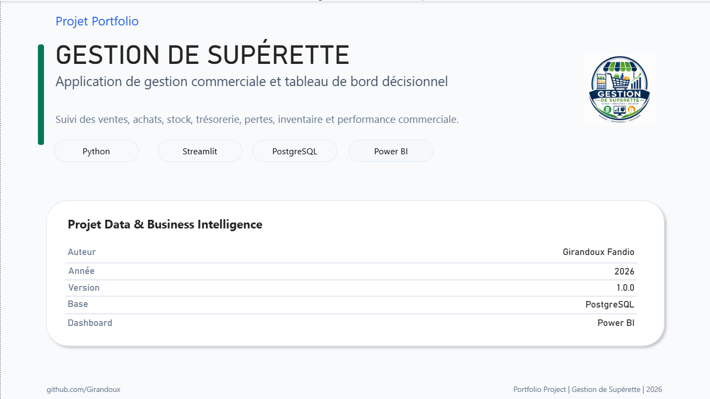
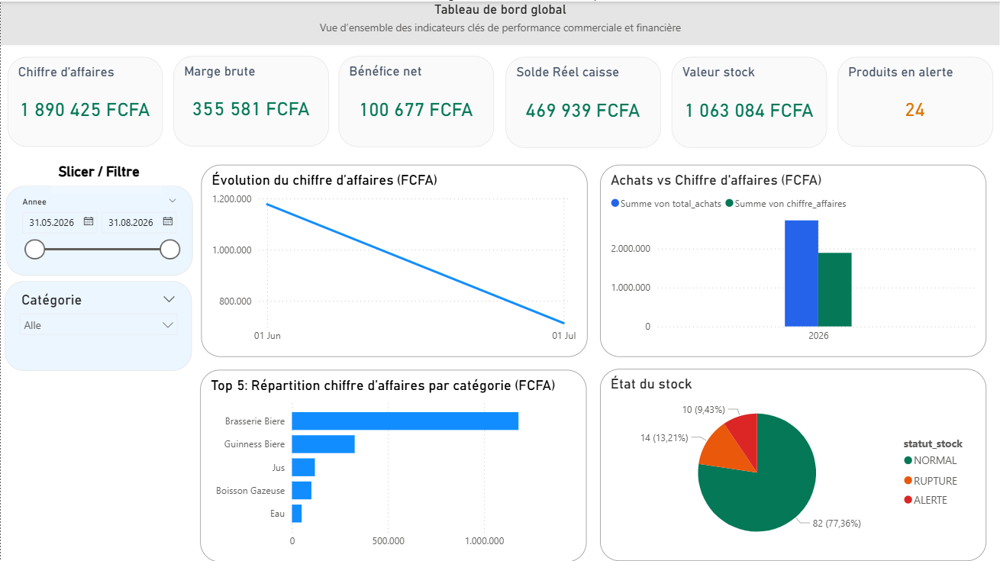
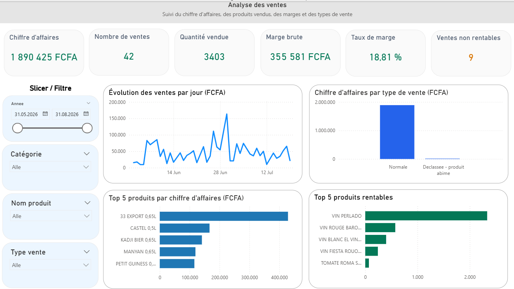
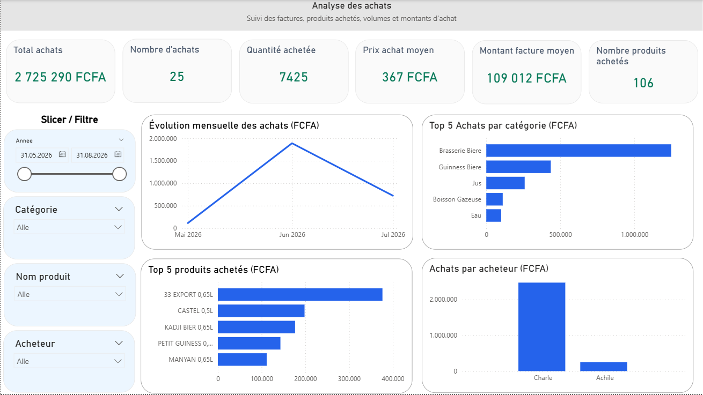
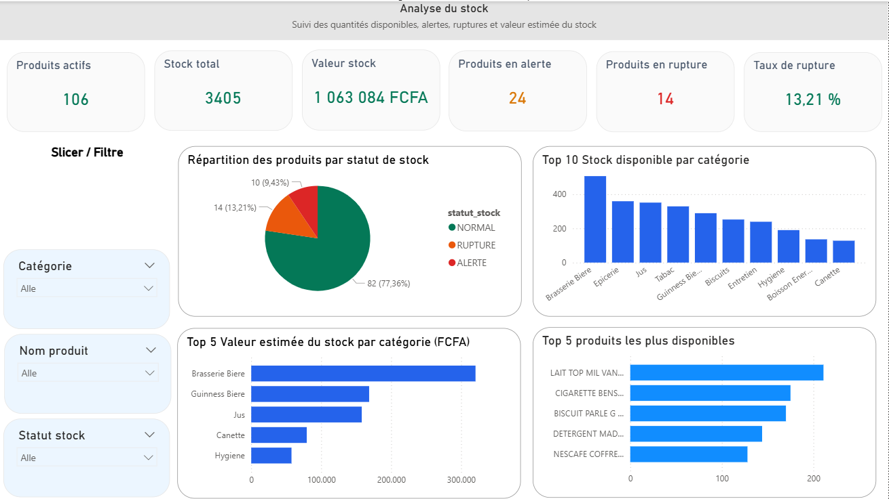
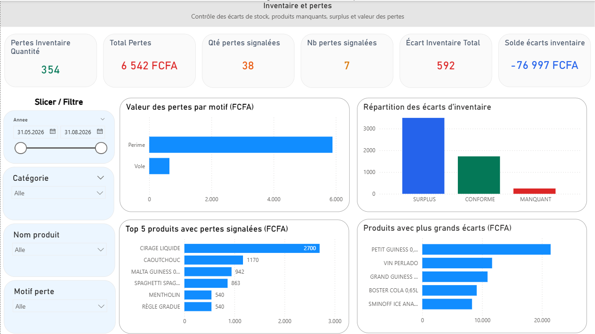
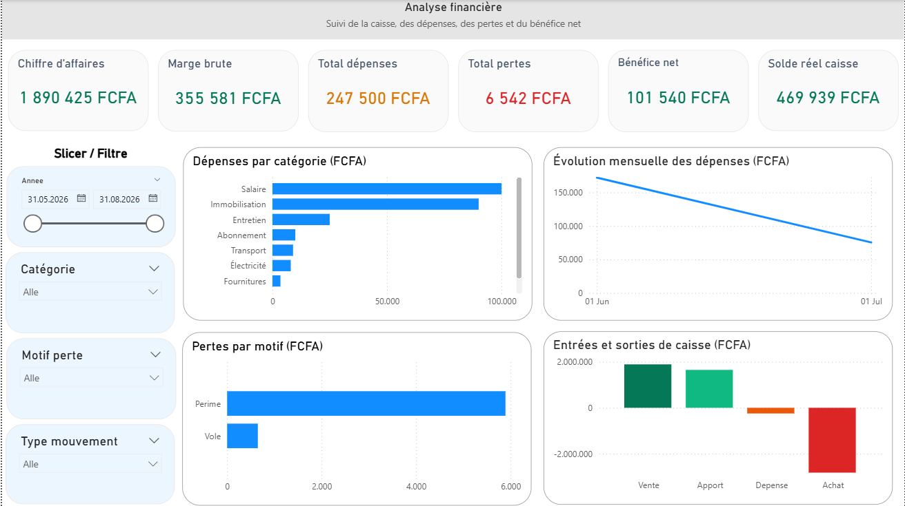
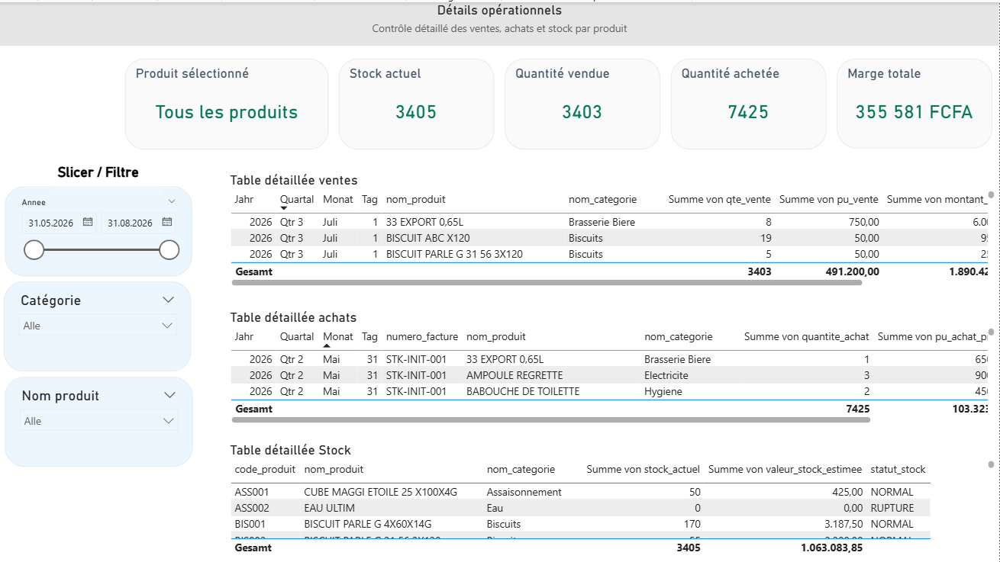

# 🛒 ERP Superette

# Digitalisierung und Analyse der Geschäftsprozesse einer kleinen Superette

> [!NOTE]
> ## Projektkontext
>
> Dieses Projekt basiert auf einem realen Anwendungsfall einer kleinen Superette in Kamerun.
>
> Ziel war es, die täglichen Geschäftsprozesse vollständig zu digitalisieren und eine zentrale Datenplattform für die Verwaltung sowie Analyse aller Geschäftsdaten zu entwickeln.
>
> Dafür wurde eine End-to-End-Lösung konzipiert und implementiert, bestehend aus einer PostgreSQL-Datenbank, einer ERP-Anwendung mit Python und Streamlit sowie interaktiven Power-BI-Dashboards.
>
> Die Lösung unterstützt die Verwaltung von Produkten, Einkäufen, Verkäufen, Lagerbeständen, Inventuren, Verlusten, Betriebsausgaben und Kassenbewegungen. Gleichzeitig liefert sie aktuelle Kennzahlen und Berichte als Grundlage für fundierte betriebliche Entscheidungen.

---

# 📖 Projektübersicht

**ERP Superette** ist ein vollständiges End-to-End-Datenprojekt zur Digitalisierung der Geschäftsprozesse einer kleinen Superette.

Das Projekt kombiniert **PostgreSQL**, **Python**, **SQLAlchemy**, **Streamlit** und **Power BI** zu einer integrierten Lösung für Datenmanagement, Geschäftsprozessverwaltung und Business Intelligence.

Die PostgreSQL-Datenbank bildet dabei die zentrale Datenbasis des Systems. Die Streamlit-Anwendung ermöglicht die tägliche Erfassung und Verwaltung der Geschäftsdaten, während Power BI dieselbe Datenbasis nutzt, um interaktive Dashboards, KPIs und Managementberichte bereitzustellen.

Das System unterstützt unter anderem folgende Geschäftsprozesse:

- 📦 Produktverwaltung
- 🛒 Einkaufsverwaltung
- 💰 Verkaufsverwaltung
- 📊 Lagerverwaltung
- 📋 Inventur
- 📉 Verlustmanagement
- 💳 Betriebsausgaben
- 💵 Kassenverwaltung
- 📈 Dashboards und Managementberichte

---

# 🎯 Projektziele

Im Mittelpunkt des Projekts standen sowohl die Digitalisierung der Geschäftsprozesse als auch die Entwicklung einer modernen Datenplattform.

Die wichtigsten Projektziele waren:

- Analyse der bestehenden Geschäftsprozesse einer kleinen Superette
- Digitalisierung und Optimierung der täglichen Arbeitsabläufe
- Entwicklung eines relationalen Datenmodells (Entity-Relationship-Diagramm)
- Aufbau einer zentralen PostgreSQL-Datenbank
- Entwicklung einer modularen ERP-Anwendung mit Python und Streamlit
- Implementierung eines ETL-Prozesses zur Migration bestehender Excel- und CSV-Daten
- Bereitstellung interaktiver Dashboards und Managementberichte mit Power BI
- Entwicklung einer wartbaren und erweiterbaren Softwarearchitektur mit klarer Trennung zwischen Datenhaltung, Geschäftslogik und Visualisierung

---

# 🏗️ Projektarchitektur

Das ERP-System besteht aus mehreren logisch getrennten Komponenten, die gemeinsam eine vollständige Datenplattform bilden.

```text
                Anforderungen des Ladenbesitzers
                              │
                              ▼
                  Analyse der Geschäftsprozesse
                              │
                              ▼
              Konzeption des relationalen Datenmodells
                         (ERD & Datenbankdesign)
                              │
                              ▼
                    PostgreSQL-Datenbank
                     (Zentrale Datenbasis)
                              ▲
                              │
                 Python ETL-Prozess (CSV/Excel)
                              │
          ┌───────────────────┴───────────────────┐
          │                                       │
          ▼                                       ▼
   Streamlit ERP                          Power BI Dashboard
 (Lesen & Schreiben)                     (Nur Lesen)
          │                                       │
          └───────────────────┬───────────────────┘
                              ▼
                   Analyse, Reporting und KPIs
```

Oder als grafische Darstellung:


Die PostgreSQL-Datenbank bildet die zentrale Datenbasis des Projekts. Die Streamlit-Anwendung greift lesend und schreibend auf die Datenbank zu und unterstützt den täglichen Geschäftsbetrieb. Power BI nutzt dieselbe Datenbasis ausschließlich lesend, um Dashboards, Kennzahlen und Managementberichte bereitzustellen.

---
# 🛠️ Verwendete Technologien

| Bereich | Technologien |
|----------|--------------|
| Programmiersprache | Python |
| Datenbank | PostgreSQL |
| SQL | PostgreSQL SQL |
| ORM | SQLAlchemy |
| Datenbanktreiber | Psycopg2 |
| Benutzeroberfläche | Streamlit |
| Business Intelligence | Power BI |
| Datenverarbeitung | Pandas, NumPy |
| Datenvisualisierung | Plotly |
| Versionsverwaltung | Git & GitHub |

---

# 🏛️ Systemarchitektur

Die folgende Abbildung zeigt die Gesamtarchitektur des ERP-Systems sowie den Datenfluss zwischen den einzelnen Komponenten.


Die PostgreSQL-Datenbank bildet die zentrale Datenbasis des Systems.

Die wichtigsten Komponenten sind:

- **Python ETL-Prozess** zur einmaligen Migration der Excel- und CSV-Daten
- **PostgreSQL** als zentrale relationale Datenbank
- **Streamlit ERP** für die tägliche Verwaltung der Geschäftsdaten
- **Power BI** für interaktive Dashboards, Analysen und Managementberichte

Alle Komponenten greifen auf dieselbe Datenbasis zu und gewährleisten dadurch konsistente und aktuelle Informationen.

---

# 🗂️ Relationales Datenmodell (ERD)

Vor der Implementierung wurde ein vollständiges **Entity-Relationship-Diagramm (ERD)** entwickelt.

Es bildet die Grundlage der PostgreSQL-Datenbank und definiert sämtliche Tabellen sowie deren Beziehungen.



Das relationale Datenmodell umfasst unter anderem:

- Dimensionstabellen
- Faktentabellen
- SQL-Views
- SQL-Funktionen
- SQL-Trigger
- Indizes

Durch dieses Datenmodell werden sämtliche Geschäftsprozesse konsistent und nachvollziehbar abgebildet.

---

# ⭐ Projekt-Highlights

✔ Analyse der Geschäftsprozesse einer kleinen Superette

✔ Entwicklung eines vollständigen relationalen Datenmodells (ERD)

✔ Aufbau einer PostgreSQL-Datenbank mit Tabellen, Beziehungen, Views, Triggern, Funktionen und Indizes

✔ Implementierung eines ETL-Prozesses zur Migration bestehender Excel- und CSV-Daten

✔ Entwicklung einer modularen ERP-Anwendung mit Python, SQLAlchemy und Streamlit

✔ Digitalisierung der Geschäftsprozesse für Einkauf, Verkauf, Lagerverwaltung, Inventur, Verluste, Betriebsausgaben und Kassenführung

✔ Entwicklung interaktiver Power-BI-Dashboards mit KPIs und Managementberichten

✔ Modulare und wartbare Softwarearchitektur mit klarer Trennung zwischen Datenhaltung, Geschäftslogik und Visualisierung

---

# 📂 Projektstruktur

```text
ERP_Superette/
│
├── config/              # Konfiguration
├── data/                # Rohdaten und Backups
├── database/            # Python-Datenbankmodule
├── docs/                # Projektdokumentation
├── images/              # Architektur und Screenshots
├── logs/                # Log-Dateien
├── powerbi/             # Power BI Dashboard
├── reports/             # Exportierte Berichte
├── sql/                 # SQL-Skripte
├── streamlit/           # Streamlit ERP
├── tests/               # Unit-Tests
├── utils/               # Hilfsfunktionen
│
├── app.py
├── requirements.txt
├── LICENSE.txt
└── README.md
```

Weitere Informationen zu den einzelnen Komponenten befinden sich in den jeweiligen Unterordnern mit eigener Dokumentation.

| Ordner | Beschreibung |
|---------|--------------|
| `config/` | Konfigurationsdateien und Datenbankeinstellungen |
| `data/` | Rohdaten, Backups und importierte Dateien |
| `database/` | Python-Module für den Datenbankzugriff |
| `docs/` | Projektdokumentation, Architektur und ERD |
| `images/` | Architekturdiagramme und Screenshots |
| `logs/` | Protokolldateien |
| `powerbi/` | Power-BI-Dashboard |
| `reports/` | Exportierte Berichte (Excel, CSV, PDF) |
| `sql/` | SQL-Skripte für Datenbank, Views, Trigger und Funktionen |
| `streamlit/` | Streamlit-ERP-Anwendung |
| `tests/` | Unit-Tests |
| `utils/` | Hilfsfunktionen und Geschäftslogik |

---
# ⚙️ Hauptfunktionen

Die ERP-Anwendung unterstützt sämtliche zentralen Geschäftsprozesse einer kleinen Superette – von der Stammdatenverwaltung bis hin zu Analysen und Berichten.

---

## 📦 Produktverwaltung

Die Produktverwaltung bildet die Grundlage des Systems.

### Funktionen

- Produkte anlegen, bearbeiten und verwalten
- Produktkategorien zuordnen
- Einkaufspreise und Verkaufspreise verwalten
- Mindestbestände definieren
- Lagerbestände überwachen
- Automatische Produktcodes verwenden

---

## 🛒 Einkaufsverwaltung

Alle Wareneinkäufe können zentral erfasst und verwaltet werden.

### Funktionen

- Einkaufsrechnungen erstellen
- Einkaufspositionen verwalten
- Automatische Rechnungsnummern vergeben
- Einkaufskosten berechnen
- Wareneingänge dokumentieren
- Lagerbestand automatisch aktualisieren

---

## 💰 Verkaufsverwaltung

Die Verkaufsverwaltung ermöglicht die vollständige Erfassung aller Verkäufe.

### Funktionen

- Verkäufe erfassen
- Verkaufspositionen verwalten
- Produkte schnell suchen
- Verkaufspreise automatisch übernehmen
- Lagerbestand prüfen
- Warnung bei negativer Marge
- Umsatz automatisch berechnen

---

## 📊 Lagerverwaltung

Die Lagerverwaltung sorgt für eine kontinuierliche Bestandskontrolle.

### Funktionen

- Aktuellen Lagerbestand anzeigen
- Mindestbestände überwachen
- Lagerbewegungen verfolgen
- Lagerwert berechnen
- Bestandsänderungen dokumentieren

---

## 📋 Inventur

Die Inventurfunktion unterstützt den Vergleich zwischen theoretischem und tatsächlichem Lagerbestand.

### Funktionen

- Inventuren durchführen
- Inventurdifferenzen berechnen
- Bestandskorrekturen dokumentieren
- Lagerbestände synchronisieren
- Inventurhistorie verwalten

---

## 📉 Verlustmanagement

Nicht verkaufbare Produkte können dokumentiert und ausgewertet werden.

### Funktionen

- Verluste erfassen
- Ursachen dokumentieren
- Auswirkungen auf den Lagerbestand berechnen
- Verluststatistiken erstellen

---

## 💳 Betriebsausgaben

Alle betrieblichen Ausgaben werden zentral verwaltet.

### Funktionen

- Betriebsausgaben erfassen
- Ausgabenkategorien verwalten
- Kostenanalysen durchführen
- Finanzübersichten erstellen

---

## 💵 Kassenverwaltung

Die Kassenverwaltung dokumentiert sämtliche Geldbewegungen.

### Funktionen

- Einzahlungen erfassen
- Auszahlungen erfassen
- Kassenbestand überwachen
- Kassensaldo berechnen
- Kassenhistorie verwalten

---

## 📈 Dashboard und Berichte

Für Management und Analyse stehen umfangreiche Berichte zur Verfügung.

### Funktionen

- Interaktive Dashboards
- Verkaufsanalysen
- Einkaufsanalysen
- Lageranalysen
- Finanzanalysen
- KPI-Übersichten
- Excel-Export
- CSV-Export
- PDF-Export

---

# 🖼️ Screenshots

Nachfolgend einige Ansichten der Power-BI-Dashboards sowie der Streamlit-ERP-Anwendung.

---

# 🖼️ Screenshots

Nachfolgend einige Ansichten der Power-BI-Dashboards sowie der Streamlit-ERP-Anwendung.

---

# 📊 Power BI Dashboards

### Berichtstitel



### Dashboard-Übersicht



### Verkaufsdashboard



### Einkaufsdashboard



### Lagerdashboard



### Inventurdashboard



### Finanzdashboard



### Operative Detailanalyse



---

# 🖥️ Streamlit ERP

### Dashboard


### Verkaufsverwaltung


---

Weitere Screenshots befinden sich im Ordner **`images/`**.
---

# 🔄 Datenfluss

Alle Komponenten des ERP-Systems greifen auf dieselbe zentrale PostgreSQL-Datenbank zu.


## Prozessbeschreibung

1. Stammdaten und Geschäftsdaten werden einmalig aus Excel- und CSV-Dateien übernommen.
2. Ein Python-ETL-Prozess bereinigt und importiert die Daten in PostgreSQL.
3. Die Streamlit-Anwendung dient als ERP-System für den täglichen Geschäftsbetrieb und schreibt neue Daten direkt in die Datenbank.
4. Power BI greift ausschließlich lesend auf vorbereitete SQL-Views zu und erstellt aktuelle Dashboards sowie Managementberichte.
5. Alle Komponenten arbeiten mit derselben zentralen Datenbasis und gewährleisten dadurch konsistente Informationen.

---

# 📈 Projektumfang

Das Projekt umfasst unter anderem folgende Komponenten:

- PostgreSQL-Datenbank
- Relationales Datenmodell (ERD)
- SQL-Skripte
- SQL-Views
- SQL-Funktionen
- SQL-Trigger
- ETL-Prozess
- Python-Anwendungslogik
- Streamlit-ERP-Anwendung
- Power-BI-Dashboard
- Exportfunktionen (Excel, CSV und PDF)
- Projektdokumentation
- Unit-Tests

---
# 🚀 Installation

## Voraussetzungen

Für die Ausführung des Projekts werden folgende Komponenten benötigt:

- Python 3.12 oder höher
- PostgreSQL
- Power BI Desktop
- Git

---

## Repository klonen

```bash
git clone https://github.com/Girandoux/ERP-Superette.git

cd ERP-Superette
```

---

## Virtuelle Umgebung erstellen

### Windows

```powershell
python -m venv .venv

.venv\Scripts\activate
```

### Linux / macOS

```bash
python3 -m venv .venv

source .venv/bin/activate
```

---

## Abhängigkeiten installieren

```bash
pip install -r requirements.txt
```

---

## PostgreSQL konfigurieren

1. PostgreSQL installieren.
2. Eine neue Datenbank erstellen.
3. Die Verbindungsdaten in der Datei

```text
config/database.py
```

anpassen.

---

## Datenbank erstellen

Die SQL-Skripte befinden sich im Ordner

```text
sql/
```

Sie sollten in folgender Reihenfolge ausgeführt werden:

1. `01_Create_Database.sql`
2. `02_Import_CSV.sql`
3. `05_Functions.sql`
4. `06_Triggers.sql`
5. `04_Views.sql`
6. `07_Indexes.sql`
7. `08_Migration_Vente_Declassee.sql`
8. `03_SQL_Analytics.sql`

---

## Streamlit-Anwendung starten

Nach erfolgreicher Einrichtung kann die ERP-Anwendung gestartet werden.

```bash
streamlit run app.py
```

Die Anwendung öffnet sich anschließend automatisch im Standard-Webbrowser.

---

# 📊 Power BI Dashboard

Das Power-BI-Dashboard befindet sich im Ordner

```text
powerbi/
```

Datei:

```text
Superette_ERP_Dashboard_v1.pbix
```

Nach dem Öffnen müssen lediglich die Verbindungsdaten zur PostgreSQL-Datenbank angepasst und die Daten aktualisiert werden.

---

# 🗺️ Roadmap

Dieses Projekt wird kontinuierlich weiterentwickelt.

Geplante Erweiterungen sind unter anderem:

- 🔐 Benutzer- und Rollenverwaltung
- 👥 Lieferantenverwaltung
- 🛍️ Kundenverwaltung
- 📦 Barcode- und QR-Code-Unterstützung
- 📊 Erweiterte Power-BI-Dashboards
- 📈 Zusätzliche KPIs und Managementberichte
- 🎨 Optimierung der Benutzeroberfläche
- 🔔 Automatische Lagerbestandswarnungen
- ☁️ Cloud-Deployment der Streamlit-Anwendung

---

# 🎯 Nachgewiesene Kompetenzen

Mit diesem Projekt konnte ich praktische Erfahrungen in den Bereichen **Data Engineering**, **Data Analytics**, **Business Intelligence** und **Softwareentwicklung** sammeln.

Zum Einsatz kamen unter anderem folgende Technologien und Konzepte:

- PostgreSQL
- SQL
- Python
- SQLAlchemy
- Psycopg2
- Pandas
- NumPy
- Streamlit
- Power BI
- Plotly
- ETL-Prozesse
- Datenmodellierung (ERD)
- Relationale Datenbanken
- Star Schema
- SQL Views
- SQL Functions
- SQL Triggers
- Dashboard-Entwicklung
- Git & GitHub

---

# 📚 Dokumentation

Für die einzelnen Komponenten des Projekts stehen ausführliche Dokumentationen zur Verfügung.

| Dokumentation | Beschreibung |
|--------------|--------------|
| `docs/README.md` | Projektübersicht, Architektur und ERD |
| `data/README.md` | Datenquellen und ETL-Prozess |
| `images/README.md` | Architekturdiagramme und Screenshots |
| `sql/README.md` | PostgreSQL-Datenbank, Tabellen, Views, Trigger und Funktionen |
| `streamlit/README.md` | Aufbau und Funktionen der ERP-Anwendung |
| `powerbi/README.md` | Datenmodell, Dashboards und KPIs |

---

# 📂 Weitere Projektinformationen

Eine detaillierte Beschreibung der einzelnen Komponenten befindet sich in den jeweiligen Unterordnern.

```text
config/
data/
database/
docs/
images/
logs/
powerbi/
reports/
sql/
streamlit/
tests/
utils/
```

---

# 👨‍💻 Autor

**Girandoux Fandio Nganwajop**

**Data Analyst | Data Engineer | Data Scientist**

Dipl.-Ing. (FH) Maschinenbau

Weiterbildung:

**Daten- und Prozessanalyse mit Python (Data Science Kompakt)**

📍 Wolfsburg, Deutschland

🔗 GitHub

https://github.com/Girandoux

---

# ⭐ Feedback

Vielen Dank für Ihr Interesse an diesem Projekt.

Ich freue mich über Feedback, Verbesserungsvorschläge oder einen fachlichen Austausch zu folgenden Themen:

- Data Analytics
- Data Engineering
- PostgreSQL
- Python
- Streamlit
- Power BI
- Business Intelligence

Wenn Ihnen dieses Projekt gefällt oder Sie meine Arbeit interessant finden, freue ich mich über einen ⭐ auf GitHub.

---

# 📄 Lizenz

Dieses Projekt steht unter der **MIT License**.

Weitere Informationen finden Sie in der Datei

```text
LICENSE.txt
```

---

# 🙏 Danksagung

Dieses Projekt entstand auf Grundlage eines realen Anwendungsfalls einer kleinen Superette in Kamerun.

Es wurde entwickelt, um Geschäftsprozesse zu analysieren, zu digitalisieren und durch moderne Methoden des **Data Engineerings**, der **Business Intelligence** und der **Softwareentwicklung** nachhaltig zu unterstützen.

Gleichzeitig dient das Projekt als Portfolio und demonstriert meine Fähigkeiten in den Bereichen Datenmodellierung, Datenbanken, ETL-Prozesse, Python-Entwicklung, Dashboard-Entwicklung und Datenvisualisierung.