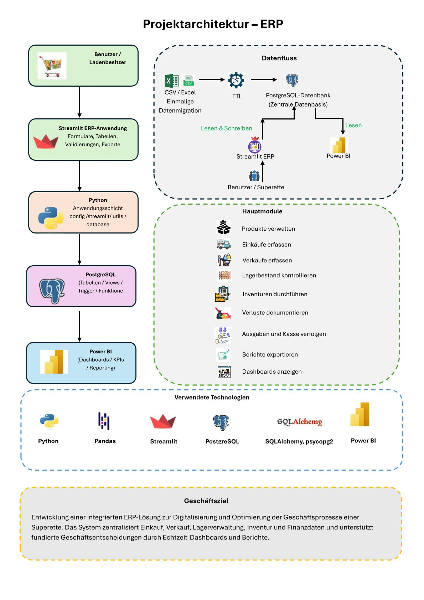

# Projektarchitektur

Die Architektur beschreibt den Aufbau und die Zusammenarbeit der einzelnen Komponenten des ERP-Superette-Systems.

## Architekturdiagramm



---

## Architekturübersicht

Das ERP-System basiert auf einer zentralen PostgreSQL-Datenbank.

Die Geschäftsdaten werden einmalig aus Excel- und CSV-Dateien übernommen und anschließend durch einen Python-ETL-Prozess in die PostgreSQL-Datenbank importiert.

Die PostgreSQL-Datenbank dient als zentrale Datenbasis für das gesamte Projekt.

- **Streamlit ERP** greift lesend und schreibend auf die Datenbank zu und ermöglicht die Verwaltung der Geschäftsprozesse.
- **Power BI** verwendet dieselbe Datenbank ausschließlich lesend, um interaktive Dashboards und Berichte zu erstellen.
- Die Python-Module übernehmen den Import, die Datenvalidierung sowie die Kommunikation zwischen der Anwendung und der Datenbank.

---

## Datenfluss

Der Datenfluss des Projekts ist wie folgt aufgebaut:

```text
CSV / Excel
(Einmalige Datenmigration)
        │
        ▼
Python ETL-Prozess
        │
        ▼
PostgreSQL-Datenbank
(Zentrale Datenbasis)
      ▲             │
      │             │ Lesen
      │             ▼
Streamlit ERP    Power BI
(Lesen &         Dashboards
 Schreiben)      und Berichte
      ▲
      │
Benutzer / Superette
```

---

## Komponenten

| Komponente | Aufgabe |
|------------|----------|
| Excel / CSV | Ausgangsdaten und einmalige Datenmigration |
| Python ETL | Import, Validierung und Transformation der Daten |
| PostgreSQL | Zentrale relationale Datenbank |
| Streamlit ERP | Verwaltung von Produkten, Einkäufen, Verkäufen, Lagerbestand, Inventur und Berichten |
| Power BI | Datenanalyse, KPIs und interaktive Dashboards |

---

## Architekturprinzip

Die PostgreSQL-Datenbank bildet das Herzstück des Projekts.

Alle Geschäftsdaten werden zentral gespeichert und sowohl von der Streamlit-ERP-Anwendung als auch von Power BI genutzt. Dadurch arbeiten alle Komponenten mit derselben Datenbasis und gewährleisten konsistente Daten für Verwaltung, Analysen und Reporting.