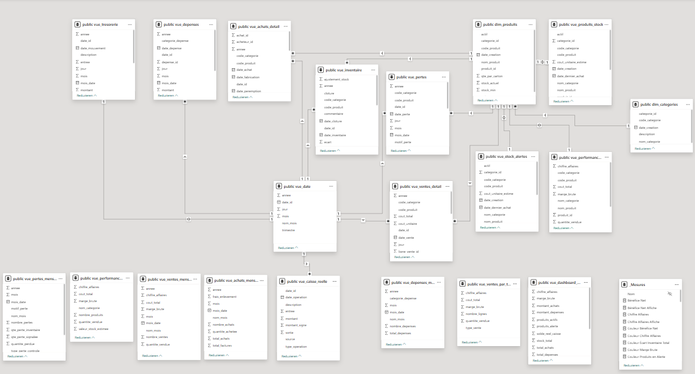

# Datenmodell und Beziehungen

## Übersicht

Das Power-BI-Dashboard basiert auf einem relationalen Datenmodell, das direkt auf der PostgreSQL-Datenbank aufsetzt.

Die Daten werden über optimierte SQL-Views bereitgestellt und anschließend in Power BI miteinander verknüpft. Durch diese Architektur bleibt das Datenmodell übersichtlich und die Berechnungen werden größtenteils bereits in PostgreSQL ausgeführt.

---

# Datenmodell

Das Modell besteht aus drei Hauptbereichen:

## Dimensionstabellen

Die Dimensionstabellen enthalten Stammdaten und dienen als gemeinsame Filterdimensionen für alle Analysen.

- `dim_date`
- `dim_produits`
- `dim_categories`

---

## Operative Views

Diese Views enthalten die täglichen Geschäftsdaten der Superette.

- `vue_ventes_detail`
- `vue_achats_detail`
- `vue_depenses`
- `vue_tresorerie`
- `vue_pertes`
- `vue_inventaire`
- `vue_caisse_reelle`

Sie bilden die Grundlage für alle Analysen und KPIs.

---

## Analyse-Views

Diese Views enthalten bereits aggregierte Kennzahlen für das Reporting.

- `vue_dashboard_global`
- `vue_produits_stock`
- `vue_stock_alertes`
- `vue_performance_produits`
- `vue_performance_categories`
- `vue_ventes_par_type`
- `vue_ventes_mensuelles`
- `vue_achats_mensuelles`
- `vue_depenses_mensuelles`
- `vue_pertes_mensuelles`

Diese Views werden hauptsächlich für Diagramme, KPIs und Managementberichte verwendet.

---

# Beziehungen

Das Datenmodell folgt einem **Star Schema (Sternschema)**.

Die Dimensionstabellen **`dim_date`**, **`dim_produits`** und **`dim_categories`** dienen als zentrale Filtertabellen und stehen mit den operativen sowie analytischen SQL-Views in Beziehung.

Die wichtigsten Beziehungen sind:

```text
                         dim_date
                            │
            ┌───────────────┼───────────────┐
            │               │               │
            ▼               ▼               ▼
   vue_ventes_detail  vue_achats_detail  vue_depenses
            │               │               │
            │               │               │
            ├───────────────┴───────────────┤
            │                               │
            ▼                               ▼
        vue_pertes                  vue_inventaire
            │                               │
            └───────────────┬───────────────┘
                            │
                            ▼
                      dim_produits
                            │
        ┌───────────────────┼────────────────────┐
        │                   │                    │
        ▼                   ▼                    ▼
 vue_produits_stock   vue_stock_alertes   vue_performance_produits
                                                │
                                                ▼
                                      vue_performance_categories

                            │
                            ▼
                   vue_dashboard_global
```
---

# Datenfluss

Das Power-BI-Dashboard nutzt dieselbe PostgreSQL-Datenbank wie die Streamlit-Anwendung.

```text
CSV-/Excel-Dateien
(Einmalige Datenmigration)
          │
          ▼
Python ETL-Prozess
          │
          ▼
PostgreSQL-Datenbank
(Zentrale Datenbasis)
      ▲             │
      │             │
Lesen & Schreiben   │ Lesen
      │             ▼
 Streamlit ERP   Power BI
      ▲
      │
Benutzer / Superette
```

## Prozessbeschreibung

1. Die Daten werden einmalig aus Excel- und CSV-Dateien übernommen.
2. Nach der Verarbeitung durch den Python-ETL-Prozess werden sie in PostgreSQL gespeichert.
3. Power BI greift ausschließlich lesend auf die Datenbank zu.
4. SQL-Views liefern vorbereitete Kennzahlen für Dashboards und Berichte.
5. Alle Analysen basieren auf derselben zentralen Datenbasis wie die Streamlit-Anwendung.

---

# Funktionsweise

Das Datenmodell ist so aufgebaut, dass alle Berichte dieselben Dimensionstabellen verwenden.

Dadurch können Filter wie:

- Zeitraum
- Produkt
- Kategorie

gleichzeitig auf mehrere Berichte und Visualisierungen angewendet werden.

Die aggregierten SQL-Views reduzieren den Berechnungsaufwand in Power BI und verbessern die Performance des Dashboards.

---

# Vorteile des Datenmodells

Dieses Modell bietet mehrere Vorteile:

- Zentrale Datenbasis in PostgreSQL
- Klare Trennung zwischen Stammdaten und Geschäftsdaten
- Wiederverwendbare SQL-Views
- Geringere Anzahl komplexer DAX-Berechnungen
- Schnelle Ladezeiten in Power BI
- Einheitliche KPIs und Berichte
- Gute Skalierbarkeit für zukünftige Erweiterungen

---

# Visualisierung des Modells

Das folgende Diagramm zeigt die Beziehungen zwischen den Tabellen und SQL-Views im Power-BI-Datenmodell.



---

# Architekturprinzip

Die PostgreSQL-Datenbank bildet die zentrale Datenbasis des Projekts.

Power BI greift ausschließlich lesend auf die Datenbank zu und nutzt vorbereitete SQL-Views für Berichte und Analysen.

Dadurch bleiben Geschäftslogik, Datenmodell und Visualisierung sauber voneinander getrennt.
