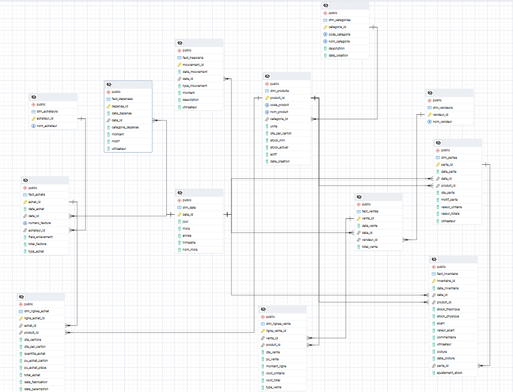
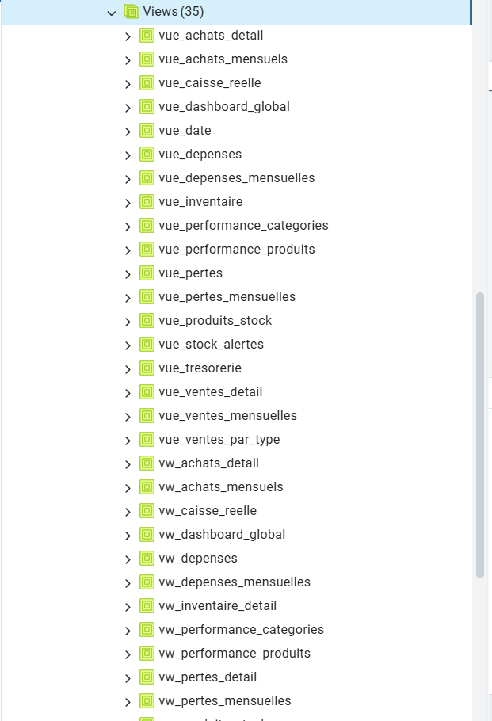
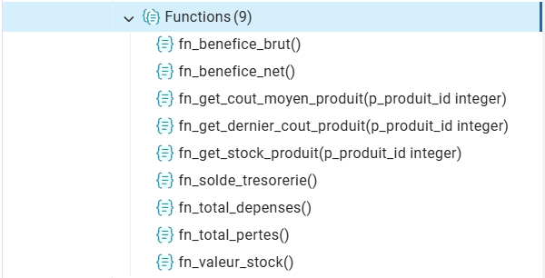
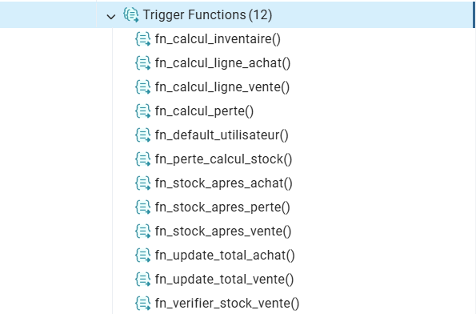
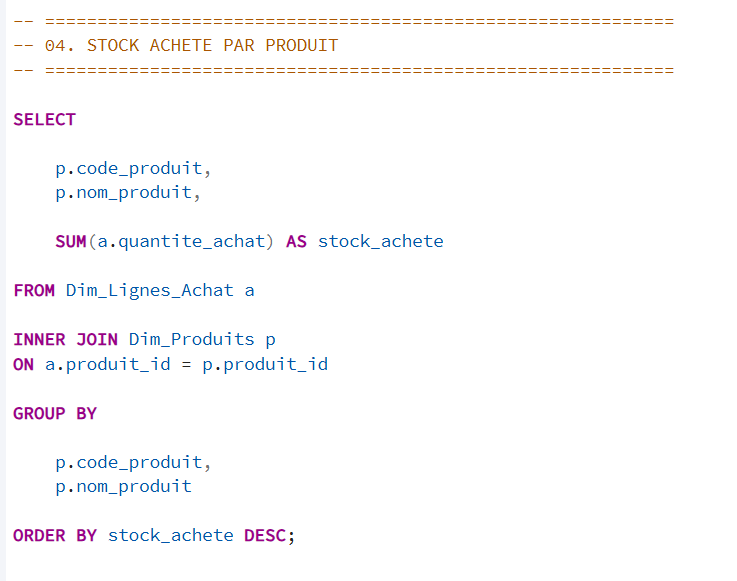
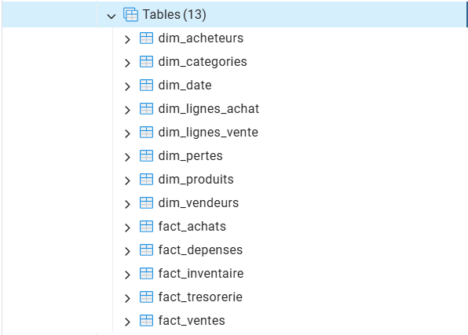

# 🗄️ SQL-Dokumentation

## Ziel

Der Ordner **`sql/`** enthält alle SQL-Skripte des Projekts **ERP Superette**.

Die PostgreSQL-Datenbank bildet die zentrale Datenbasis des Systems. Sie verwaltet sämtliche Geschäftsprozesse der Superette und stellt optimierte SQL-Views für die Streamlit-ERP-Anwendung sowie das Power-BI-Dashboard bereit.

Die SQL-Skripte übernehmen die Erstellung der Datenbankstruktur, den Datenimport, die Geschäftslogik sowie die analytische Aufbereitung der Daten.

---

# Struktur

```text
sql/
│
├── README.md
├── 01_Create_Database.sql
├── 02_Import_CSV.sql
├── 03_SQL_Analytics.sql
├── 04_Views.sql
├── 05_Functions.sql
├── 06_Triggers.sql
├── 07_Indexes.sql
└── 08_Migration_Vente_Declassee.sql
```

---

# Datenbankmodell

Die PostgreSQL-Datenbank basiert auf einem relationalen Datenmodell mit Dimensionstabellen, Faktentabellen und analytischen SQL-Views.

Sie bildet die zentrale Datenbasis für das gesamte ERP-System.



---

# Entity-Relationship-Diagramm (ERD)

Das vollständige relationale Datenmodell wird im folgenden ERD dargestellt.


Die Tabellen sind über Primär- und Fremdschlüssel miteinander verbunden und gewährleisten eine konsistente Datenstruktur.

---

# SQL-Dateien

| Datei | Beschreibung |
|--------|--------------|
| `01_Create_Database.sql` | Erstellt die PostgreSQL-Datenbank, Tabellen, Primärschlüssel und Fremdschlüssel. |
| `02_Import_CSV.sql` | Importiert die CSV-Dateien in die PostgreSQL-Datenbank. |
| `03_SQL_Analytics.sql` | Enthält analytische SQL-Abfragen für Berichte und Auswertungen. |
| `04_Views.sql` | Erstellt SQL-Views für Streamlit ERP und Power BI. |
| `05_Functions.sql` | Erstellt SQL-Funktionen für automatische Berechnungen und Geschäftslogik. |
| `06_Triggers.sql` | Erstellt Trigger zur Sicherstellung der Datenkonsistenz. |
| `07_Indexes.sql` | Erstellt Indizes zur Optimierung der Datenbankperformance. |
| `08_Migration_Vente_Declassee.sql` | Migriert historische Verkaufsdaten („Vente Déclassée“) in das aktuelle Datenmodell und unterstützt die Datenübernahme in die PostgreSQL-Datenbank. |

---

# Installationsreihenfolge

Die SQL-Dateien sollten in folgender Reihenfolge ausgeführt werden:

```powershell
psql -U postgres -d Superette -f sql/01_Create_Database.sql

psql -U postgres -d Superette -f sql/02_Import_CSV.sql

psql -U postgres -d Superette -f sql/05_Functions.sql

psql -U postgres -d Superette -f sql/06_Triggers.sql

psql -U postgres -d Superette -f sql/04_Views.sql

psql -U postgres -d Superette -f sql/07_Indexes.sql

psql -U postgres -d Superette -f sql/08_Migration_Vente_Declassee.sql

psql -U postgres -d Superette -f sql/03_SQL_Analytics.sql
```

---

# Tabellen

## Dimensionstabellen

Die Dimensionstabellen enthalten die Stammdaten des ERP-Systems.

- `dim_date`
- `dim_categories`
- `dim_produits`
- `dim_acheteurs`
- `dim_vendeurs`

---

## Faktentabellen

Die Faktentabellen speichern sämtliche Geschäftsvorgänge der Superette.

- `fact_achats`
- `dim_lignes_achat`
- `fact_ventes`
- `dim_lignes_vente`
- `fact_depenses`
- `fact_tresorerie`
- `fact_inventaire`
- `dim_pertes`

---

# SQL-Views

Die SQL-Views stellen vorbereitete Daten für Streamlit ERP und Power BI bereit.



Wichtige Views:

- `vue_dashboard_global`
- `vue_ventes_detail`
- `vue_achats_detail`
- `vue_produits_stock`
- `vue_stock_alertes`
- `vue_tresorerie`
- `vue_caisse_reelle`
- `vue_pertes`
- `vue_inventaire`
- `vue_performance_produits`
- `vue_performance_categories`
- `vue_ventes_par_type`
- `vue_ventes_mensuelles`
- `vue_achats_mensuelles`
- `vue_depenses_mensuelles`
- `vue_pertes_mensuelles`

Diese Views reduzieren den Berechnungsaufwand in Power BI und ermöglichen eine performante Datenanalyse.

---

# SQL-Funktionen



Die SQL-Funktionen automatisieren wiederkehrende Berechnungen innerhalb der Datenbank.

Beispiele:

- Berechnung des Lagerbestands
- Berechnung von Inventurdifferenzen
- Aktualisierung von Summen
- Verwaltung von Sequenzen
- Umsetzung von Geschäftsregeln

---

# SQL-Trigger



Die Trigger sorgen für eine konsistente Datenhaltung und aktualisieren automatisch wichtige Informationen.

Sie übernehmen unter anderem:

- Aktualisierung der Einkaufssummen
- Aktualisierung der Verkaufssummen
- Anpassung des Lagerbestands
- Berechnung von Inventurdifferenzen
- Aktualisierung der Kassenbewegungen

---

# Analytische SQL-Abfragen



Die Datei **`03_SQL_Analytics.sql`** enthält analytische SQL-Abfragen für:

- Verkaufsanalysen
- Einkaufsanalysen
- Lageranalysen
- Finanzanalysen
- Inventurkontrollen
- Managementberichte

Diese Abfragen bilden die Grundlage für zahlreiche Visualisierungen in Power BI und Streamlit.

---

# PostgreSQL-Tabellen



Diese Abbildung zeigt die Tabellenstruktur der PostgreSQL-Datenbank.

---

# Datenfluss

# Datenfluss

Die SQL-Skripte bilden die Grundlage der PostgreSQL-Datenbank und unterstützen den gesamten Datenfluss des ERP-Superette-Projekts.

```text
CSV-/Excel-Dateien
(Einmalige Datenmigration)
          │
          ▼
Python ETL-Prozess
          │
          ▼
PostgreSQL-Datenbank
(Zentrale Datenbasis)
      ▲             │
      │             │
Lesen & Schreiben   │ Lesen
      │             ▼
 Streamlit ERP   Power BI
      ▲
      │
Benutzer / Superette
```

## Prozessbeschreibung

1. Die SQL-Skripte erstellen die Datenbankstruktur.
2. Der Python-ETL-Prozess importiert die Daten in PostgreSQL.
3. SQL-Views, Funktionen und Trigger automatisieren Berechnungen und Geschäftslogik.
4. Streamlit ERP greift lesend und schreibend auf die Datenbank zu.
5. Power BI nutzt vorbereitete SQL-Views ausschließlich für Berichte und Analysen.

---

# Verwandte Ordner

```text
database/
data/
docs/
images/
powerbi/
streamlit/
```

Diese Ordner arbeiten direkt mit den SQL-Skripten und der PostgreSQL-Datenbank zusammen.

---

# Hinweise

Nach Änderungen an Tabellen oder Datenstrukturen sollten immer auch folgende Komponenten überprüft werden:

- SQL-Views
- SQL-Funktionen
- SQL-Trigger
- Python-ETL
- Streamlit ERP
- Power-BI-Dashboard

Dadurch bleibt das gesamte System konsistent und funktionsfähig.

---

# Lizenz

Dieser Ordner ist Bestandteil des Projekts **ERP Superette**.

© 2026 Girandoux Fandio Nganwajop